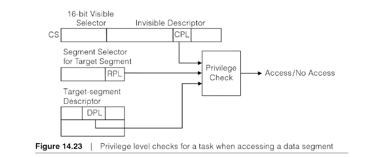

# lec4: lab1 SPOC思考题

##**提前准备**
（请在上课前完成）

 - 完成lec4的视频学习和提交对应的在线练习
 - git pull ucore_os_lab, v9_cpu, os_course_spoc_exercises in github repos。这样可以在本机上完成课堂练习。
 - 了解x86的保护模式，段选择子，全局描述符，全局描述符表，中断描述符表等概念，以及如何读写，设置等操作
 - 了解Linux中的ELF执行文件格式
 - 了解外设:串口，并口，时钟，键盘,CGA，已经如何对这些外设进行编程
 - 了解x86架构中的mem地址空间和io地址空间
 - 了解x86的中断处理过程（包括硬件部分和软件部分）
 - 了解GCC的x86/RV内联汇编
 - 了解C语言的可函数变参数编程
 - 了解qemu的启动参数的含义
 - 在piazza上就lec3学习中不理解问题进行提问
 - 学会使用 qemu
 - 在linux系统中，看看 /proc/cpuinfo的内容

## 思考题

### 启动顺序

1. x86段寄存器的字段含义和功能有哪些？
	
	* cs: program code segment 代码段 cs:eip代表程序计数器
	* ds: data segment 数据段
	* es: extra segment 硬件无特殊用途
	* fs: 同上
	* gs: 同上 
	* ss: stack segment 栈段 ss:esp代表栈顶 ss:ebp有时用来标记一个stackframe (pushl %ebp; movl %esp, %ebp;)

2. x86描述符特权级DPL、当前特权级CPL和请求特权级RPL的含义是什么？在哪些寄存器中存在这些字段？对应的访问条件是什么？
		
	* CPL: Current Privilege Level CS寄存器中（不可见）
	* RPL: Request Privilege Level 段寄存器低2位 访问同一个段可以用不同的RPL
	* DPL: Descriptor Privilege Level 段描述符中
	
	他们的取值都是[0, 3], 数值越小权限越高。
	当进程访问一个段时,需要进行进程特权级检查,要求DPL >= max(CPL, RPL) 

	
	
	The X86 Microprocessor, 2e, 14-32

3. 分析可执行文件格式elf的格式（无需回答）

### 4.1 C函数调用的实现
	
与机器字宽、编译器版本、函数声明有关。无特殊函数声明 / 特殊编译选项, 使用GCC编译器，不考虑浮点和结构体参数 / 返回值：

* 32-bit：参数从右向左压栈，调用者清理堆栈
* 64-bit：前6个参数使用rdi, rsi, rdx, rcx, r8, r9, 之后从右到左压栈，调用者清理堆栈

### 4.2 x86中断处理过程

1. x86/RV中断处理中硬件压栈内容？用户态中断和内核态中断的硬件压栈有什么不同？

	如果有特权级的转换，这时CPU将系统当前使用的栈切换成新的内核栈，紧接着就将当前程序使用的用户态的ss和esp压到新的内核栈中保存起来；然后依次压入当前被打断程序使用的eflags，cs，eip，errorCode（如果是有错误码的异常）信息。

	不同之处在于前者发生了特权级的切换，需要进行栈切换并向切换后栈压入原先的ss, esp以能返回。

	对应下面`struct trapframe`中的3个部分(1-3)，用户态中断硬件压栈第2、3部分，内核态硬件压栈第2部分。

		struct trapframe {
		    struct pushregs tf_regs;
		    uint16_t tf_gs;
		    uint16_t tf_padding0;
		    uint16_t tf_fs;
		    uint16_t tf_padding1;
		    uint16_t tf_es;
		    uint16_t tf_padding2;
		    uint16_t tf_ds;
		    uint16_t tf_padding3;
		    uint32_t tf_trapno;
		    /* below here defined by x86 hardware */
		    uint32_t tf_err;
		    uintptr_t tf_eip;
		    uint16_t tf_cs;
		    uint16_t tf_padding4;
		    uint32_t tf_eflags;
		    /* below here only when crossing rings, such as from user to kernel */
		    uintptr_t tf_esp;
		    uint16_t tf_ss;
		    uint16_t tf_padding5;
		} __attribute__((packed));

2. 为什么在用户态的中断响应要使用内核堆栈？

	保护中断服务程序。

3. x86中trap类型的中断门与interrupt类型的中断门有啥设置上的差别？如果在设置中断门上不做区分，会有什么可能的后果?

	调用interrupt gate时，CPU会自动禁止中断（清除EFLAGS IF）；调用trap gate时则保留原先状态。如果设置中断门不作区分，可能与代码是否允许嵌套中断的行为不匹配，从而错误地嵌套触发中断 / 无法正常响应应处理的嵌套中断。

### 4.3 练习四和五 ucore内核映像加载和函数调用栈分析

1. ucore中，在kdebug.c文件中用到的函数`read_ebp`是内联的，而函数`read_eip`不是内联的。为什么要设计成这样？

	`read_eip`内联，因为无法直接访问`eip`，需要通过调用`read_eip`时将`eip`压栈，然后读取出来。栈示意图如下（跳转到`read_eip`并执行了`pushl %ebp; movl %esp, %ebp`之后）
			
		caller stackframe
		return addr
		old ebp <- new ebp
	
	因此可以用`4(%ebp)`获得原先`eip`的值。
	
	`read_ebp`非内联，因为可以直接访问`ebp`,但要用`read_eip`的方法也是可以的（换成`0(%ebp)`）。

### 4.4 练习六 完善中断初始化和处理

1. CPU加电初始化后中断是使能的吗？为什么？

	不是。需要在内存中建立中断向量表（IDT），x86为此还需要建立好GDT，切换到保护模式。

## 开放思考题

1. 在ucore/rcore中如何修改lab1, 实现在出现除零异常时显示一个字符串的异常服务例程？

	修改`kern/trap/trap.c`中`trap_dispatch`，增加`tf->tf_trapno`为0的case, 调用`cprintf`即可。

2. 在ucore lab1/bin目录下，通过`objcopy -O binary kernel kernel.bin`可以把elf格式的ucore kernel转变成体积更小巧的binary格式的ucore kernel。为此，需要如何修改lab1的bootloader, 能够实现正确加载binary格式的ucore OS？ (hard)
3. GRUB是一个通用的x86 bootloader，被用于加载多种操作系统。如果放弃lab1的bootloader，采用GRUB来加载ucore OS，请问需要如何修改lab1, 能够实现此需求？ (hard)
4. 如果没有中断，操作系统设计会有哪些问题或困难？在这种情况下，能否完成对外设驱动和对进程的切换等操作系统核心功能？

	* 管理外设：无中断则可能需要用轮询的方式，效率很低
	* 安全权限：隔离用户程序与内核，切换安全级等
	* 系统调用 / 异常处理：利用内核态功能实现一定功能 / 错误处理

	单驱动外设是可能的，可以轮询。但进程切换可能需要程序中插入一些特殊的指令主动指示CPU切换进程 (yield?)，否则就只能等它执行完。

## 课堂实践
### 练习一
在Linux系统的应用程序中写一个函数print_stackframe()，用于获取当前位置的函数调用栈信息。实现如下一种或多种功能：函数入口地址、函数名信息、参数调用参数信息、返回值信息。

----------

利用Linux系统提供的功能可以得到入口地址信息，编译时加`-rdynamic`选项后还能得到**非static函数**的函数名信息。当然这个函数也会显示自身。 注意不要开优化选项。

	const size_t BT_BUF_SIZE = 100;
	
	void print_stackframe() {
	    void *buffer[BT_BUF_SIZE];
	    int nptrs = backtrace(buffer, BT_BUF_SIZE);
	    printf("backtrace() returned %d addresses\n", nptrs);
	    backtrace_symbols_fd(buffer, nptrs, STDOUT_FILENO);
	}

### 练习二
在ucore/rcore内核中写一个函数print_stackframe()，用于获取当前位置的函数调用栈信息。实现如下一种或多种功能：函数入口地址、函数名信息、参数调用参数信息、返回值信息。

见lab1 练习5.